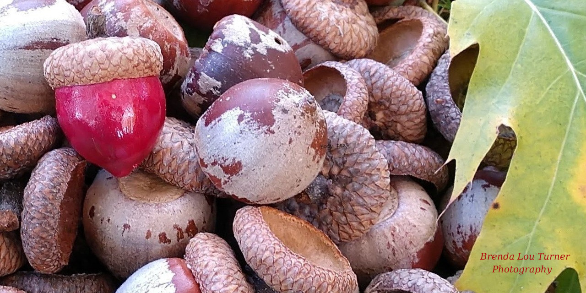

# acorn



---

**Author:** Tychele N. Turner, Ph.D.

**License:** MIT License

**Current version:** 0.99.9

**Readme Update Date:** 11/26/2025

**Description:** Acorn is an R package that works with de novo variants (DNVs) already called using a DNV caller (e.g., https://github.com/TNTurnerLab/HAT). The toolkit is useful for extracting different types of DNVs and summarizing characteristics of the DNVs.

---

> [!NOTE]
> Please cite this paper if using this tool: Turner TN. Acorn: an R package for de novo variant analysis. BMC Bioinformatics. 2023 Sep 2;24(1):330. doi: 10.1186/s12859-023-05457-z. PMID: 37660114; PMCID: PMC10475174.

---

**Install:**
The two commands below should install acorn to R and make it callable inside R with `library('acorn')`. Please note you should have R installed already on your computer.
```
wget https://data.cyverse.org/dav-anon/iplant/home/tycheleturner/acorn_releases/acorn_0.99.9.tar.gz
R CMD INSTALL acorn_0.99.9.tar.gz
```

**Example Files:** Files for use in testing are available in `inst/extdata` folder in acorn and include

Example DNV files
```
dnms_from_Ng_et_al_2022_Human_Mutation_paper.txt.gz
dnms_from_Ng_et_al_2022_Human_Mutation_paper_not_compressed.txt
mnv_test.txt
```

Example files for parental age information
```
dnm_count_example.txt
parental_age_example.txt 
```

**Current Functions:**

Function to read in a file for use in many of the other functions in acorn. If you have not yet called de novo variants from your sequencing data, check out our tool called HAT at https://github.com/TNTurnerLab/HAT. Within the HAT GitHub repository, there is a code called `squirrel.py` that can convert HAT output to acorn input for use with this R package.
```
readDNV = Reads in a de novo variant (DNV) file in the format of sample, 
chromosome, genomic position, reference allele, alternate allele, and 
then any optional columns. File must be tab-delimited and the file must 
have the data in the order listed above (i.e., sample is field 1, chromosome 
is field 2, genomic position is field 3, reference allele is field 4, and 
alternate allele is field 5. The file can either be a uncompressed file or 
can be a gz compressed file. Please note that the chromosome data should 
take the form with a "chr" at the beginning (e.g., chr1).

Returns back a loaded in version of the DNV file that can be assigned to 
an object.
```

Function to extract a given individual:
```
extractIndividual = Extracts the DNVs out of a dnvObject from a particular 
individual. Returns a DNV object containing only DNVs in the specified
individual.
``` 

Functions to extract by variant type:
```
extractSNVs = Extracts single-nucleotide variants (SNVs) out from a DNV object
generated using the readDNV function. Returns a DNV object containing only SNVs.

extractINDELs = Extracts small insertions/deletions (INDELs) out from a DNV 
object generated using the readDNV function. Returns a DNV object containing 
only INDELs.

extractMNVs = Extracts multi-nucleotide variants (MNVs) out from a DNV object
generated using the readDNV function. Returns a DNV object containing only MNVs.

```

Functions to extract by genomic region:
```
extractAutosomes = Extracts the autosomes (chromosomes 1 to 22) out from a DNV 
object originally generated using the readDNV function. You can also run this 
on objects generated from extractSNVs, extractINDELs, or extractMNVs. Returns 
a DNV object containing only DNVs on the autosomes.

extractX = Extracts the X chromosome out from a DNV object originally generated 
using the readDNV function. You can also run this on objects generated from
extractSNVs, extractINDELs, or extractMNVs. Returns a DNV object containing 
only DNVs on the X chromosome.

extractY = Extracts the Y chromosome DNVs out from a DNV object originally 
generated using the readDNV function. You can also run this on objects 
generated from extractSNVs, extractINDELs, or extractMNVs. Returns a DNV 
object containing only DNVs on the Y chromosome.
```

Summary characteristics of DNV data
```
calculateTiTvRatio = This function will automatically grab only the SNVs from 
the DNV object for the calculation of the transition/transversion (Ti/Tv) ratio.
Returns the counts of transitions, the counts of transversions, the Ti/Tv ratio,
and a barplot of the different types of SNV changes observed in the DNV object.

calculateDeletionInsertionRatio = This function will automatically grab only 
the INDELs from the DNV object for the calculation of the deletion/insertion 
ratio. Returns the counts of deletions, the counts of insertions, and the
deletion/insertion ratio.

calculateDeletionLengths = This function will automatically grab only the 
deletions from the DNV object for the calculation of the length of the 
deletions. Returns the length of the deletions, in the form of an object, 
observed in the DNV object. It also returns a barplot of the deletion lengths.

calculateInsertionLengths = This function will automatically grab only the 
insertions from the DNV object for the calculation of the length of the 
insertions. Returns the length of the insertions, in the form of an object, 
observed in the DNV object. It also returns a barplot of the insertion lengths.

calculateMNVLengths = This function will automatically grab only the 
multi-nucleotide variants (MNVs) from the DNV object for the calculation of 
the length of the MNVs. Returns the length of the MNVs, in the form of an 
object, observed in the DNV object. It also returns a barplot of the MNVs 
lengths.

```

Annotate and summarize CpG
```
annotateCpG = Extracts single-nucleotide variants (SNVs) out from a DNV 
object generated using the readDNV function and assigns whether they are at
a CpG site or not. This function also requires a pre-computed rda file for 
the CpG sites in the genome of interest. This is available for b38 of the
human genome at:  
https://data.cyverse.org/dav-anon/iplant/home/tycheleturner/genomic_annotations/cpg_b38.rda. 
Returns a DNV object containing only SNVs and includes a column with a 
note on whether the DNV is at a CpG or not. This function also prints 
out the number of CpG and the percent of DNV SNVs at CpG. Please note 
this function typically takes at least one minute to run.
```

Further information on `annotateCpG`
The CpG annotation file used is too large to package within acorn and 
that is why it is not included in the vignette. If you want to test out the 
`annotateCpG` function, please run the following

* In R, download the b38 annotation file (your system will need `wget`). You 
could also download directly to your computer outside of R.
```
system("wget https://data.cyverse.org/dav-anon/iplant/home/tycheleturner/genomic_annotations/cpg_b38.rda")
```

* In R, run the test data
```
#load the library
library('acorn')

#load the CpG annotation
load("cpg_b38.rda")

#read in test DNV data
input <- readDNV(paste(path.package("acorn"),"/extdata/dnms_from_Ng_et_al_2022_Human_Mutation_paper.txt.gz",sep="")) 

#run the annotateCpG
CpGresult <- annotateCpG(DNVobject = input, CpGannot = cpg_b38)
```

Summary of DNV counts per individual. Also, useful to generate input for the parentalAgeObject
```
countsPerIndividual = This function will count the DNVs from a DNV object 
originally generated using the readDNV function. You can also run this on 
objects generated from extractSNVs, extractINDELs, or extractMNVs. Returns 
the mean of the DNV counts per individual, the standard deviation of the DNV 
counts per individual, a plot of the density of the DNV counts per individual,
and an object consisting of the sample name and the counts of their DNVs that
can be assigned to another object.
```

Parental age characteristics of DNVs
```
parentalAgeObject = Takes in a counts object that is either the result of
countsPerIndividual() or is already read into an object from a file that 
contains the following two fields: sample and number of DNVs. The parental 
age object should be read in and contain the following fields: sample, 
father age at child's birth, and mother age at child's birth. Returns back
an object with the de novo counts and parental age data together. The 
fields in this file are sample, dnm_counts, fatherAge, and motherAge.

parentalAge = This function will calculate the correlation between father's 
and mother's age at birth and DNV counts per individual, the results of the 
linear model taking the form: lm(formula = dnm_counts ~ fatherAge+motherAge, 
data = parentalAgeObject) or the exponential model taking the form
lm(log(dnm_counts)~fatherAge+motherAge, data=parentalAgeObject). Input 
required is output from the parentalAgeObject function in this package. 
Returns the results of the linear model taking the form: 
lm(formula = dnm_counts ~ fatherAge + motherAge, data = parentalAgeObject) or
the exponential model taking the form 
lm(log(dnm_counts)~fatherAge+motherAge, data=parentalAgeObject). It also
returns a plot of father's and mother's age at birth and DNV counts.

fatherAge = This function will calculate the correlation between father's 
age at birth and DNV counts per individual, the results of the linear model 
taking the form: lm(formula = dnm_counts ~ fatherAge, data = parentalAgeObject)
or the exponetial model taking the form
lm(log(dnm_counts)~fatherAge, data=parentalAgeObject).
Input required is output from the parentalAgeObject function in this package.
Returns the correlation between father's age at birth and DNV counts per 
individual and the results of the linear model taking the form: lm(formula =
dnm_counts ~ fatherAge, data = parentalAgeObject) or the exponential model taking
the form  lm(log(dnm_counts)~fatherAge, data=parentalAgeObject). 
It also returns a plot of father's age at birth and DNV counts.

motherAge = This function will calculate the correlation between mother's 
age at birth and DNV counts per individual, the results of the linear model 
taking the form: lm(formula = dnm_counts ~ motherAge, data = parentalAgeObject) 
or the exponential model taking the form
lm(log(dnm_counts)~motherAge, data=parentalAgeObject).
Input required is output from the parentalAgeObject function in this package.
Returns the correlation between mother's age at birth and DNV counts per 
individual and the results of the linear model taking the form: lm(formula =
dnm_counts ~ motherAge, data = parentalAgeObject) or the exponential model
taking the form lm(log(dnm_counts)~motherAge, data=parentalAgeObject). 
It also returns a plot of mother's age at birth and DNV counts.
```

**Implementation of functions in an Rstudio session:** An example of running the code in Rstudio is found [here](https://github.com/TNTurnerLab/acorn/blob/main/vignettes/acorn_vignette.Rmd) and its output is [here](https://github.com/TNTurnerLab/acorn/blob/main/vignettes/acorn_vignette.pdf) in the `example` directory.

